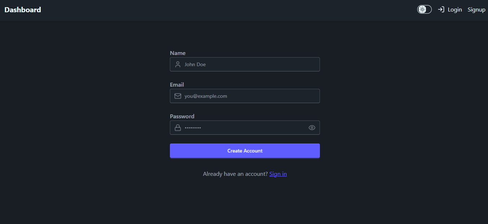
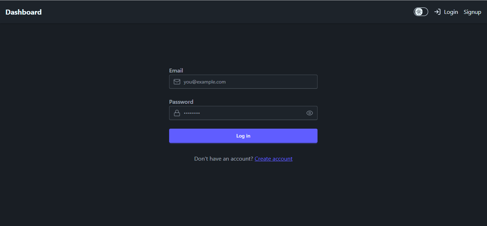
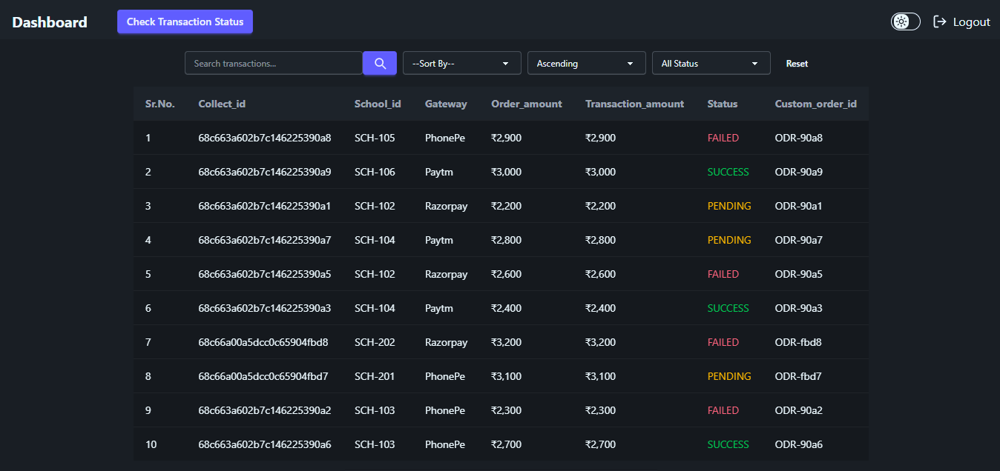
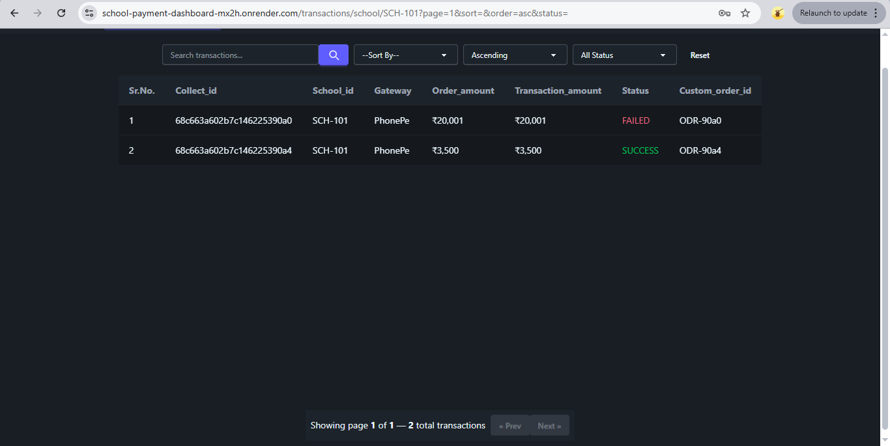
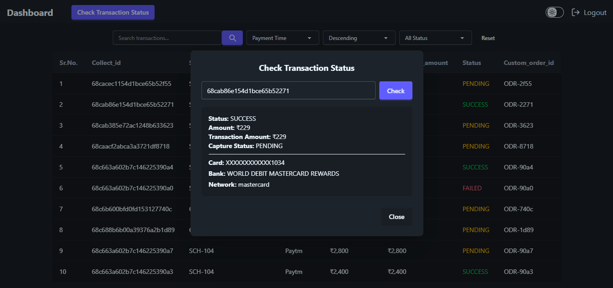
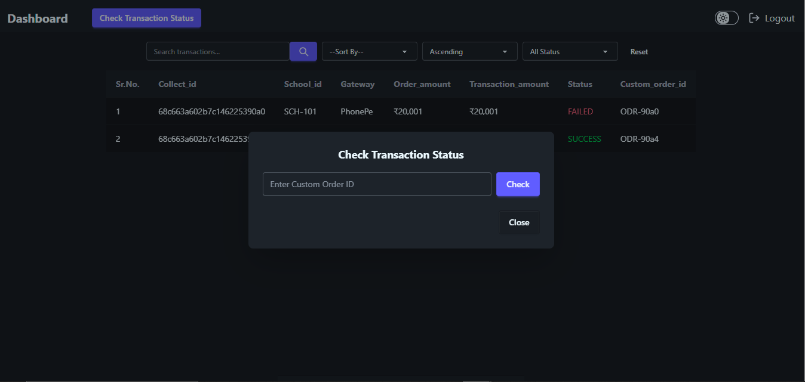
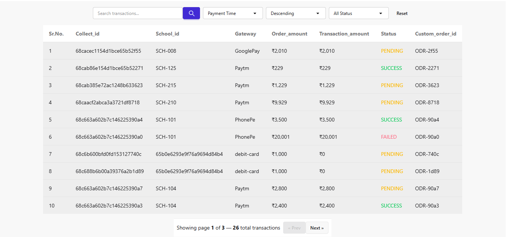

# School Payment & Dashboard
Live demo: https://school-payment-dashboard-mx2h.onrender.com/
Clone the repository:
```bash
git clone https://github.com/WebMohit20/school_payment_dashboard.git
cd school_payment_dashboard
```

## Description
Simple school payment gateway integration and dashboard. Backend requires a .env file with the settings listed below.

## Prerequisites
- Node.js (>= 22)
- npm 
- MongoDB (URI for cloud or local instance)

## Setup (.env)
Create a `.env` file in the `backend` folder with these variables:

```env
MONGODB_URI=your_mongodb_connection_string
PORT=3000

EXPIRES_IN=5h
JWT_SECRET=....

PAYMENT_PG_KEY=....
PAYMENT_API_KEY=....
PAYMENT_API_URL_POST=https://dev-vanilla.edviron.com/erp/create-collect-request
PAYMENT_API_URL_GET=https://dev-vanilla.edviron.com/erp/collect-request

SCHOOL_ID=65b0e6293e9f76a9694d84b4
```

Notes:
- Set `MONGODB_URI` to your MongoDB connection string.
- `JWT_SECRET` should be a secure random string.
- Fill `PAYMENT_PG_KEY` and `PAYMENT_API_KEY` with credentials provided by the payment provider.

## Install & Run (backend)
From the repository root (Windows PowerShell / CMD):

```powershell
cd backend
npm install
npm run start   # or: node index.js / npm run dev depending on scripts
```

Default server port: 3000 (configured via PORT).

## Payment API
- POST collect request: `PAYMENT_API_URL_POST`
- GET collect request: `PAYMENT_API_URL_GET`

These are set to the dev endpoints by default. Replace with production endpoints when ready.

## Troubleshooting
- Verify `.env` values and that MongoDB is reachable.
- Check case-sensitive file paths for images/assets if referenced elsewhere.
- Inspect backend logs in the terminal for runtime errors.

## License
Specify repository license as needed.















# Frontend User Guide

## Navbar (user-facing features)
- Dashboard  
  - Main page that lists all transactions.
  - Provides filters/search and links to transaction details (if implemented).

- Check Status  
  - Opens a page where the user can enter a School ID and submit to check payment/collection status.
  - Returns status results and any relevant metadata for the school.

- Theme Toggle  
  - Switches between light and dark themes for the UI.
  - Preference is typically persisted (localStorage) so the chosen theme remains across sessions.

- Logout  
  - Clears authentication (token/session) and redirects the user to the login page.
  - Ensure any sensitive state is cleared on sign-out.

## Dashboard — Filters, Search and Reset (user flow)
The dashboard main page includes:
- A search bar for a specific School ID.
  - Enter a school ID and click the search button to navigate to:
    /transactions/school/:schoolId
  - Example navigation: /transactions/school/65b0e6293e9f76a9694d84b4

- Three filters (each is a dropdown) and a Reset button:
  1. Sort by
     - Dropdown with 3 selectable options (examples: Payment Date, Transaction Amount, Status). These control which field is used to sort the results.
  2. Order
     - Dropdown with two options:  (ascending) or  (descending).
  3. Status
     - Dropdown listing available payment statuses (e.g., Pending, Success, Failed). Selecting a status filters the transactions to show only those with the chosen status.

- Reset button
  - Clears all filters and the search field, returning the dashboard to its default unfiltered state.

Behavior notes:
- Filters apply together (e.g., Sort by Date + Order desc + Status Completed).
- The UI may update results client-side or by requesting the backend with query parameters.
  - Suggested query parameter names: ?schoolId=...&sortBy=...&order=...&status=...
  - Example: /transactions?sortBy=date&order=desc&status=completed

